# **APP FINANCIERA "BANQUI"**

_"Banqui_, es una app financiera perteneciente al Banco de Crédito del Perú (BCP), que permite a sus usuarios crear una cuenta bancaria 100% digital, sin plástico, ni papeleos para acceder a ella."

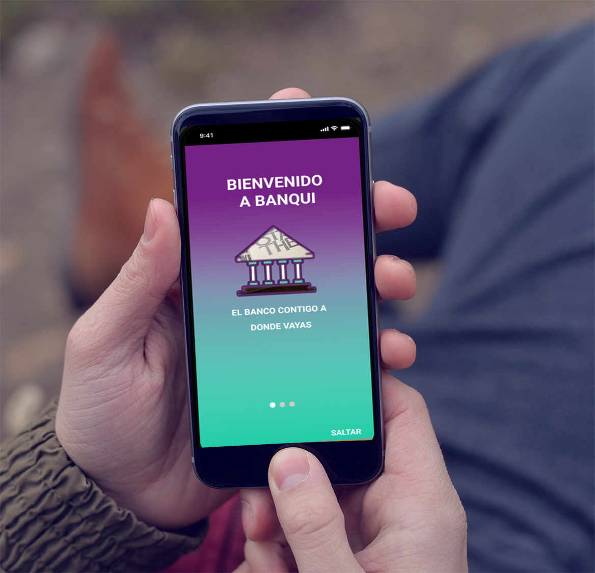

## Índice
___
- [Introducción](#introducción)
- [Objetivos del Proyecto](#objetivos-del-proyecto)
- [Problemas encontrados](#Problemas-encontrados)
- [Implementación](#implementación)
- [Nuestro proceso de rediseño UX](#Nuestro-proceso-de-rediseño-UX)
    - [1. Descubrimiento e investigación](#1.Descubrimiento-e-investigación)
        - [Entrevista con el Cliente](#Entrevista-con-el-cliente)
        - [Entrevista con el Usuario](#Entrevista-con-el-Usuario)
        - [Benchmark](#Benchmark)

     - [2. Síntesis y Definición](#2.Síntesis-y-Definición)
        - [Affinity Map](#affinity-map)
        - [User Persona](#user-persona)
        - [Customer Journey Map](#customer-journey-map)
        - [Definición del Producto](#definicion-del-producto)

     - [3. Ideación del producto](#3.Ideación-del-producto)
        - [Sketch](#Sketch)

    - [4.Prototipado y Testing](#4.Prototipado-y-Testing)

- [Enlaces](#enlaces)

## Introducción
---
El Banco de Crédito del Perú (BCP), es uno de los bancos más importante del país. Es una institución de muchos años y actualmente está pasando por un proceso de transformación digital. Como parte de este proceso, han implementado un área de innovación que quiere llegar de una mejor manera a los usuarios. Inspirados en el bbva de España, Banco of America y  Capital One  crearon un banco 100% digital. Las cifras indican que la aplicación financiera de dicho banco no ha elevado su tasa de retención en los últimos 6 meses, por lo que ha visto conveniente recurrir a UX Consulting para que realicen el resideseño de la aplicación.

## Objetivos del Proyecto
---
* Identificar los problemas que posee actualmente la aplicación financiera “Banqui”.
* Realizar una propuesta de rediseño, con un flujo mucho más amigable para el usuario.

## Problemas encontrados
---
### Análisis de la data
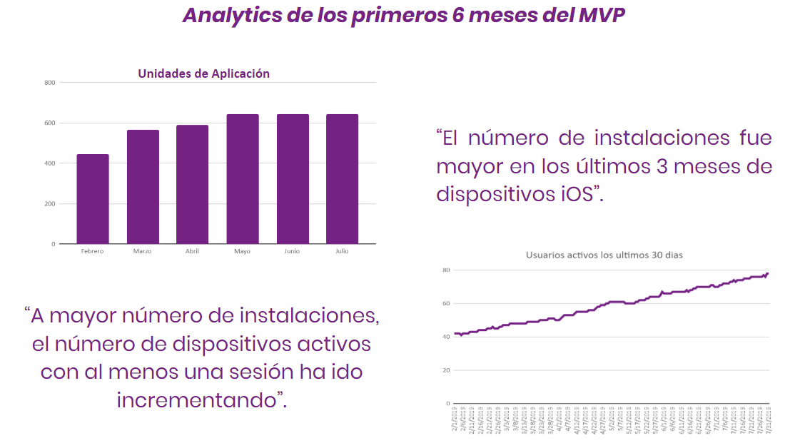
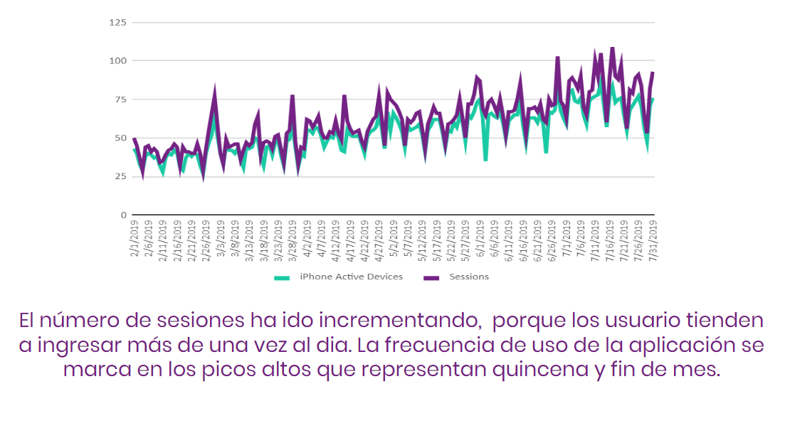
### Testing del MVP
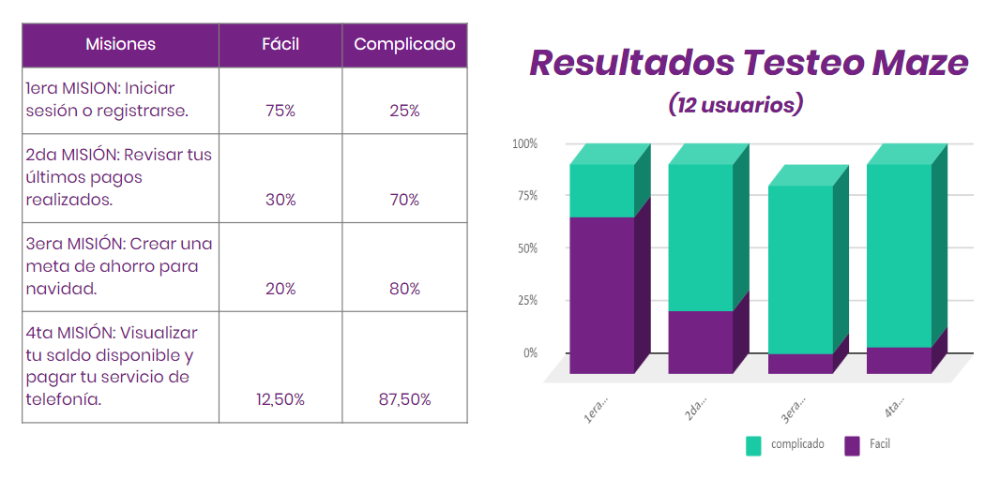
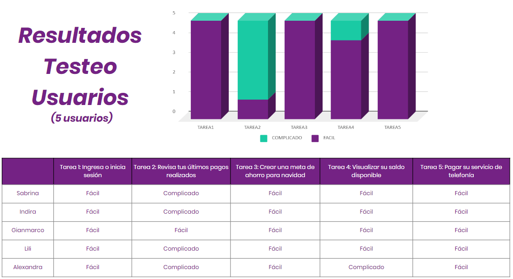

## Implementación
---
 Para realizar este proyecto hemos seleccionado las siguientes actividades para poder crear nuestra propuesta de valor:

|Actividad|Descripción|Puntos|
|:----|:---|:---:|
|Entendimiento del problema y análisis de data|Entender a fondo el problema tras haber analizado la data entregada.|15|
|Entrevista con cliente|Realización de entrevistas con el cliente (Trabajador del bcp) y establecimiento de sus metas y objetivos.| 25 |
|Benchmark| Revisión de la competencia y referencias indirectas. | 20 |
|Entrevistas con usuarios| Entrevistas con al menos 5 usuarios. | 60 | 
|Sketching | Elaboración de prototipo de baja fidelidad. | 30 |
|Prototipado de alta fidelidad| Rediseño del prototipo anterior en base a las conclusiones obtenidas | 80 |
|Testeos de prototipos| Sesiones de testing de la solución propuesta (baja y alta fidelidad) con al menos 5 usuarios por sesión. | 60 |
|| Total | 290  |

## Nuestro proceso de rediseño UX
---
Todas las actividades y productos generados en esta investigación estuvo enmarcado en el Diseño centrado en el usuario y se pueden dividir en las siguientes etapas del proceso Design Thinking.
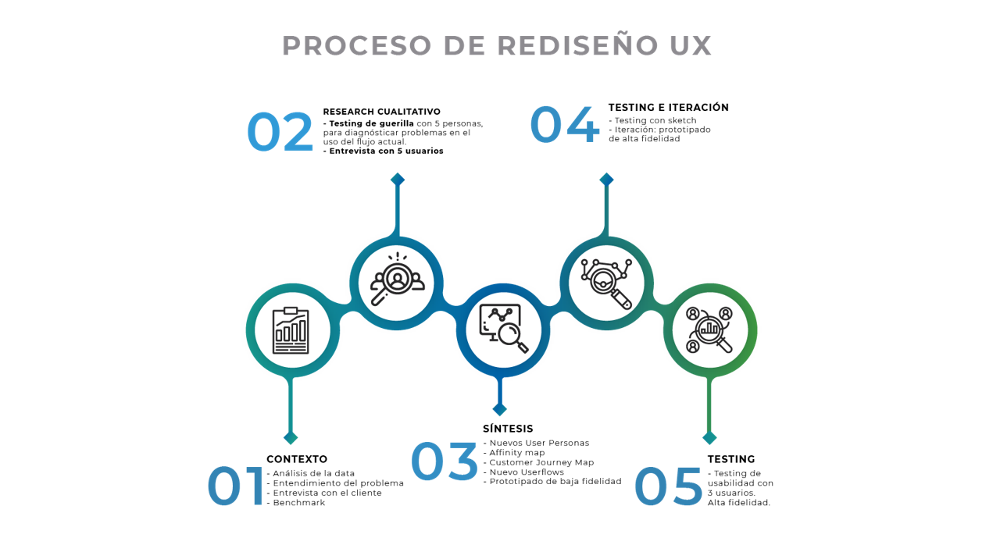
### 1.Descubrimiento e investigación
En esta fase aplicamos las siguientes herramientas que nos ayudaron a entender el contexto, el usuario, al cliente y a la empresa.
#### Entrevista con el Cliente:
La entrevista fue realizada el 05 de Setiembre a las 16:30 horas  a Michael Gonzales Neyra, Product owner del BCP.   
   * ***[Guia de entrevista](https://drive.google.com/open?id=1MLLl2BL-ohYSedoryB5mD0Zb7EiCMhoPx9AZzVy2dSk)***
   * ***[Audio](https://drive.google.com/drive/folders/1Fi9K2--BG1EbGJmbsPXmLNfzKb_rTLzH)***

Se obtuvo como conclusiones más resaltantes:
* Banqui es una forma de banco que genere en el cliente no solo confianza si no un toma de decisiones rápida.
* Los objetivos de Banqui son 2 como negocio:
  * Aumentar la satisfacción del cliente con los canales digitales. 
  * Al 2020 quien que al menos el 70% de sus ventas (producto o servicio bancario)  sean a través de los canales digitales. Considerando que el otro 30% lo haría aún en un lugar físico.
* Sus proyecciones al 2020 es ser la mejor app del Perú y al 2024 ser la app con mejor servicio.
* Como principios el negocio tiene:
  * Satisfacción del cliente
  * Personalizados, que se adapte a cada persona.
* Menciona que las expectativas de Banqui son:
* Ser en el 2021 ser el principal canal de atención del banco.
* Tener el mayor porcentaje de mercado a nivel digital.
* Que de un 70% de clientes sean digitales.     
    ***[Ver más resultados aquí](https://drive.google.com/open?id=1l-3TAd4MmJTyUNbYvlLO0JjjJqW_UINv3iqk3_gZlAI)***

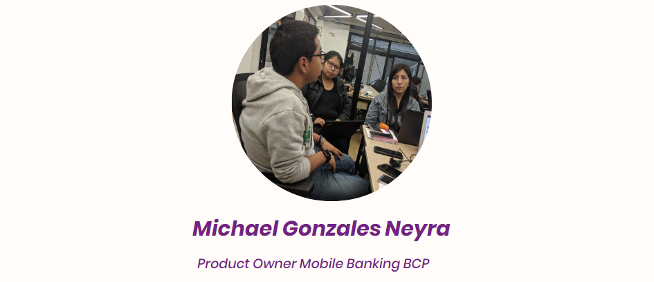

#### Entrevista con el usuario
Se llevó a cabo con 5 usuarios, 3 varones y 2 mujeres. Sus edades promedian entre los 25 y 28 años.
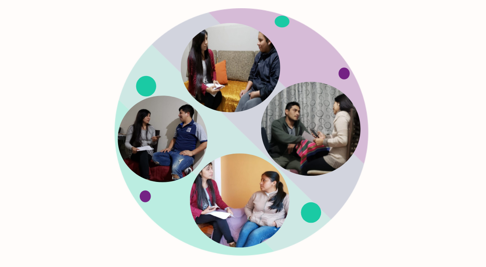

* ***[Guia de entrevista](https://drive.google.com/open?id=1_uADh5MlrDfdHOZfiRTeJINUCmmPm1zH_YdgsNLAaVs)***

* ***[Audio](https://drive.google.com/drive/folders/1_tOx4-0k6dZri65XKx6Js2mW4C5HJWjU)***
 
Conclusiones más relevantes:
* El 100% de los usuarios usa android
* Los usuarios suelen usar más la función de transferencia.
* Les agrada tener beneficios como descuentos y ganar puntos para poder canjearlos.
* La aplicación bancaria  que más suelen usar es la del bcp.
* Que le notifique cuando me llega un depósito.
* Poder ver sus movimientos sin tiempo limitado
* Suelen pagar sus servicios y compras a través de la aplicación bancaria.
* La mayoría ahorra o desea ahorrar.
* Para poder generar un buen ahorro desea que la aplicación bancaria le descuente un monto en una fecha determinada y que se le envíe una notificación de ello.
* Desean tener como seguridad el respaldo de una entidad financiera.

#### Benchmark
Para tener un panorama más claro y certero de las aplicaciones financieras decidimos realizar un cuadro de Benchmarking de las plataformas líderes en nuestro país y en América Latina. 
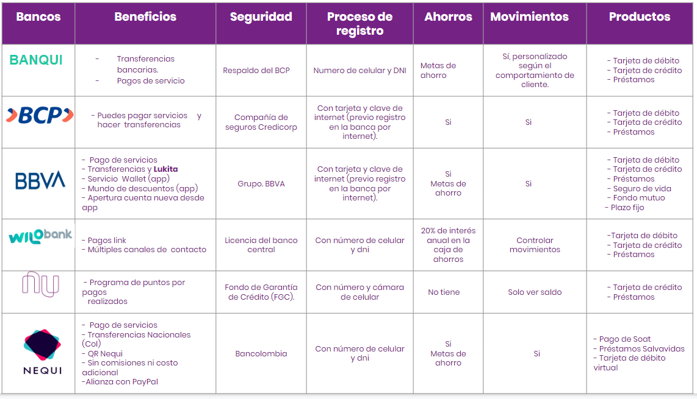

### 2.Síntesis y definición
Esta etapa nos permitió aterrizar hallazgos en una propuesta de valor. 
#### Affinity Map
Con los resultados de las entrevistas a 5 usuarios y 5 usuarios testeado, realizamos un Afinity map para organizar y sintetizar lo que encontramos y así analizar las preferencias o gustos en común que tienen.
Ordenamos por categorías las respuestas de las entrevistas para sintetizar y analizarlas. 
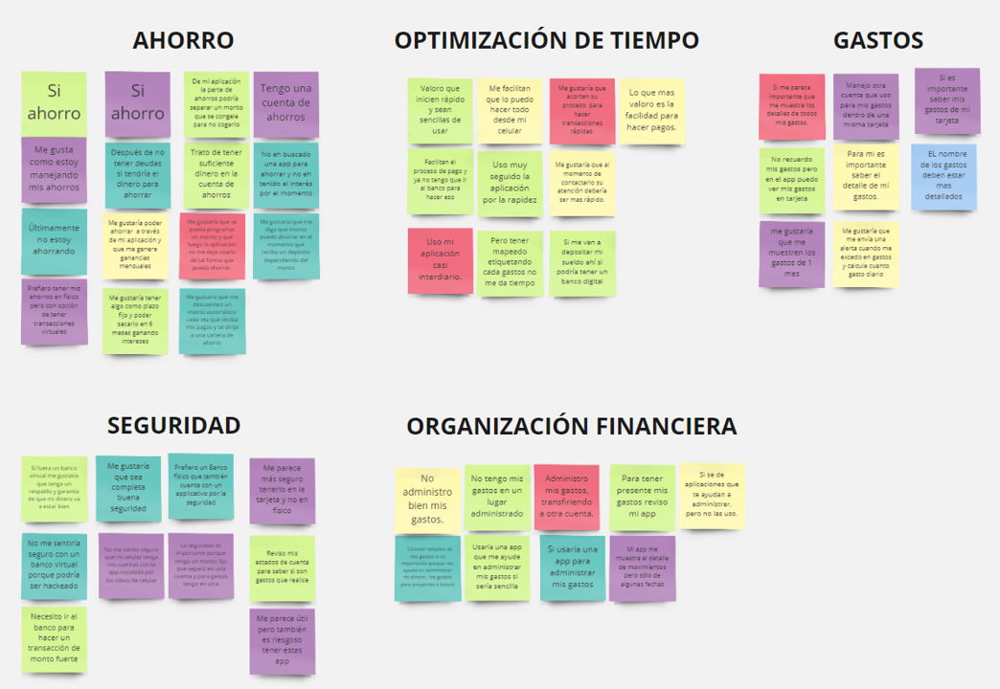
- [Ver aquí la versión completa](https://miro.com/app/board/o9J_kwtzQsg=/)

Gracias al diagrama de afinidad, logramos enfocarnos en 5 categorías más nombradas: Ahorro, gastos, organización financiera, optimización del tiempo y seguridad.
* Ahorro
    - La mayoría de usuarios suelen ahorrar.
    - Desean una aplicación que les motive a ahorrar.
    - Que su ahorro le genere intereses.
*  Gastos
    - Desean saber el detalle de sus gastos.
    - Organización financiera.
    - Poder administrar mis gastos, a través de la aplicación financiera.
    - Optimización del tiempo.
    - Facilidad al momento de pagar los servicios.
    - Transacciones al instante desde un móvil.
    - Poder revisar sus movimientos de forma rápida y sencilla.
* Seguridad
    - Tener el respaldo de una entidad financiera.

#### User Persona
Con toda la información proporcionada en la investigación, decidimos modificar el user persona ya que no reflejaba al usuario objetivo.

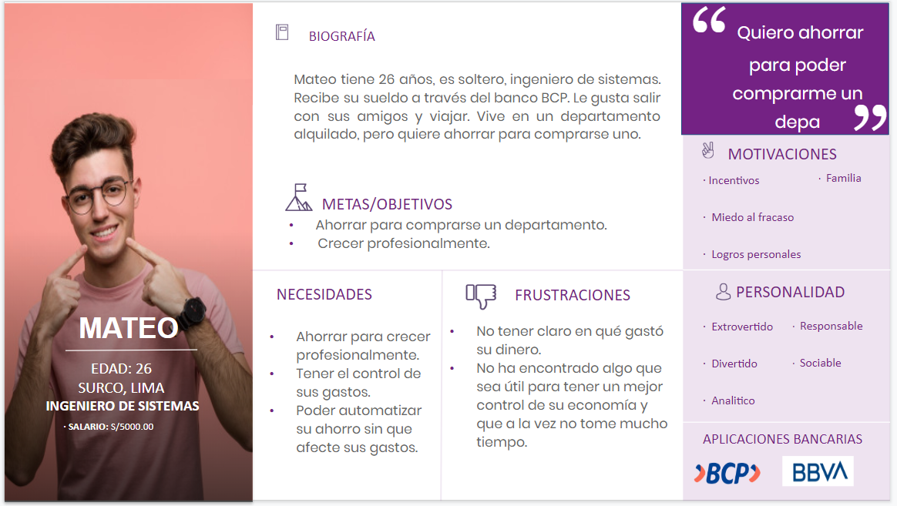

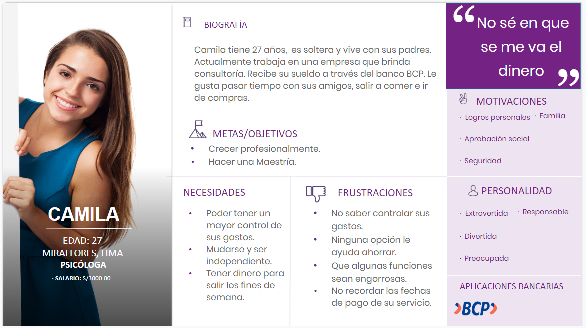

#### Customer Journey Map
Se realizó un mapa de viaje, para identificar los puntos críticos de los usuarios en las diferentes etapas de cuando quieren ingresar, ver su saldo disponible, pagar un servicio y revisar sus gastos realizados.
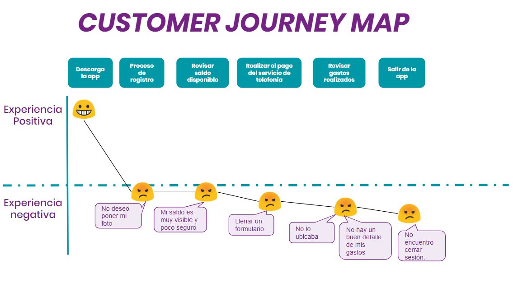

#### Problem statements y how might we

***1. Camila, necesita ser motivada  a través de su aplicación de banca móvil  para poder ahorrar.***

_HMW_ ¿Cómo podríamos motivar a los usuarios a ahorrar a través de la banca móvil?

***2. Mateo, quisiera pagar de una manera fácil y práctica porque no quiere invertir mucho tiempo haciendo colas en el banco.***

_HMW_ ¿Cómo podríamos ofrecerle simplicidad y facilidad de uso, para que el usuario se sienta más cómodo con un banco 100% digital.

***3. Camila, necesita tener el control  de sus finanzas y de forma detallada, para saber en qué está gastando su dinero.***

_HMW_ ¿Cómo podríamos generar un control de sus finanzas para que pueda saber en qué gasta su dinero?

***4. Mateo, quisiera ver sin limitaciones de fechas todas sus transacciones realizadas para poder controlar de forma eficiente sus gastos.***

_HMW_ ¿Cómo podríamos ofrecerle un control de sus transacciones sin limitaciones de tiempo, para que el usuario pueda controlar sus gastos de manera eficiente?

***5. Mateo, necesita tener respaldo y garantía de que su dinero estará seguro, para poder confiar en Banquil.***
_HMW_ ¿Cómo podríamos ofrecerle garantía y respaldo, para que el usuario pueda confiar en Banqui.

#### Definicion del producto
Rediseño de MVP
* Crear un onboarding, con un animal (conejo de la suerte), que de indicaciones y además motive la cultura de ahorro.
* Optimizar el formulario de pago de servicios, que se ubica en la función operaciones.
* Consulta de movimientos en orden cronológico.
* Retiro en cualquier entidad financiera asociada mediante su número de DNI.
* Pagos de servicios e instituciones (Agua, luz, teléfono, celular, Netflix, universidad, etc).
* Publicidad informativa sobre el respaldo financiero que tiene y seguridad que brinda a sus usuarios, a través de medios de comunicación.

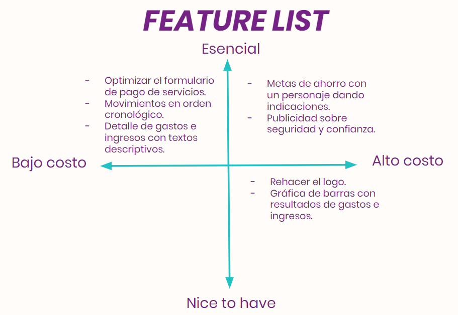

### 3.Ideación del producto
#### Sketch
Iniciamos realizando un prototipo de baja fidelidad en donde plasmamos diversas ideas para poder mejorar la experiencia del usuarios, de acuerdo a las conclusiones de testing del prototipo interactivo inicial y de las entrevistas a usuarios.

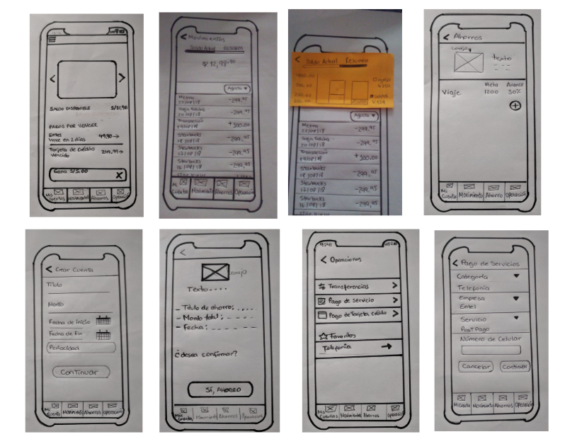

Resultados: 
* Realizan todas las rutas, sin complicaciones.
* No les parece muy interactivo el gráfico de ingresos y gastos.
* Preguntaron por la forma de cerrar sesión.

### 4.Prototipado y Testing

#### Prototipado en alta fidelidad
Nuestro prototipo de alta fidelidad muestra las interacciones que serán parte del producto final y corresponde a las funcionalidades que solucionan los 5 problem statements que hemos priorizado. 
* ***[Prototipo de alta fidelidad en Figma](https://www.figma.com/file/oVBcWvcSPrEFzswD9gMrVX/APP-BANQUI-VISTAS-MODIFICADAS?node-id=0%3A1)***
* ***[Prototipo interactivo en Invision](https://projects.invisionapp.com/share/ZTU125OX2VD#/screens)***
#### Testing
Hicimos testing con 5 usuarios entre 25 y 30 años. Y sacamos dos conclusiones principales:
* Mejorar la forma en como se muestra el gráfico de movimientos.
* Mejorar el tamaño de los elementos y estilos de las letras, para una mejor funcionalidad.

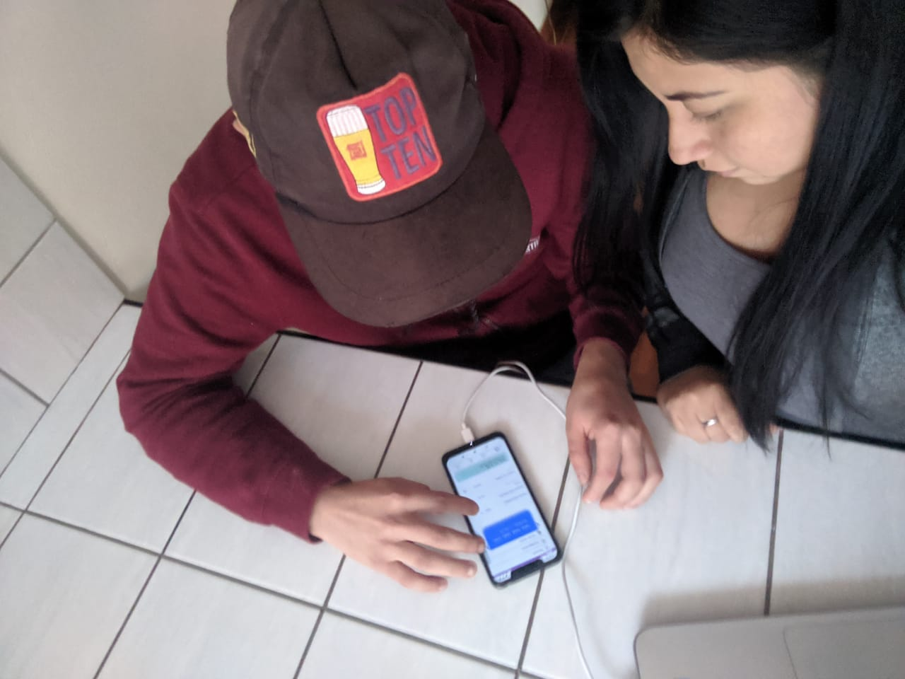

## Enlaces
* Mira el video de nuestra presentación del desarrollo del proyecto
Link de Loom ---> ***[Aquí](https://www.loom.com/share/44323583ab054ae98ca307c13a19d153)***
* Conoce a detalle el proceso de trabajo de este rediseño
Acceso a la documentación ---> ***[Ir al drive](https://drive.google.com/drive/folders/1PNLcThY4PgDvOf8Iyy9JcdrWXayjuSh2)***

